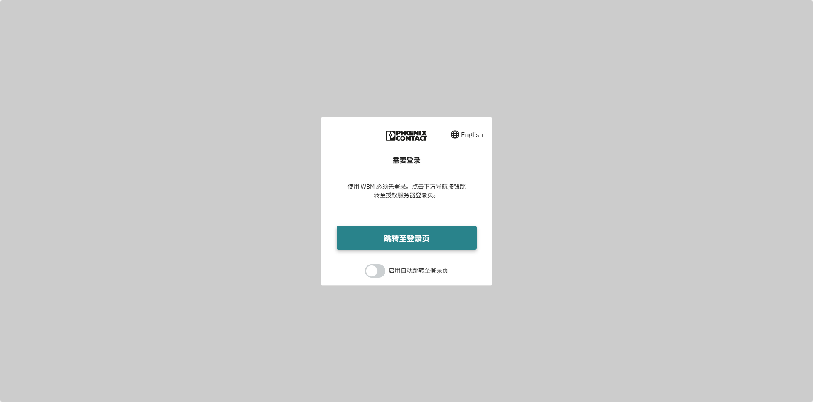
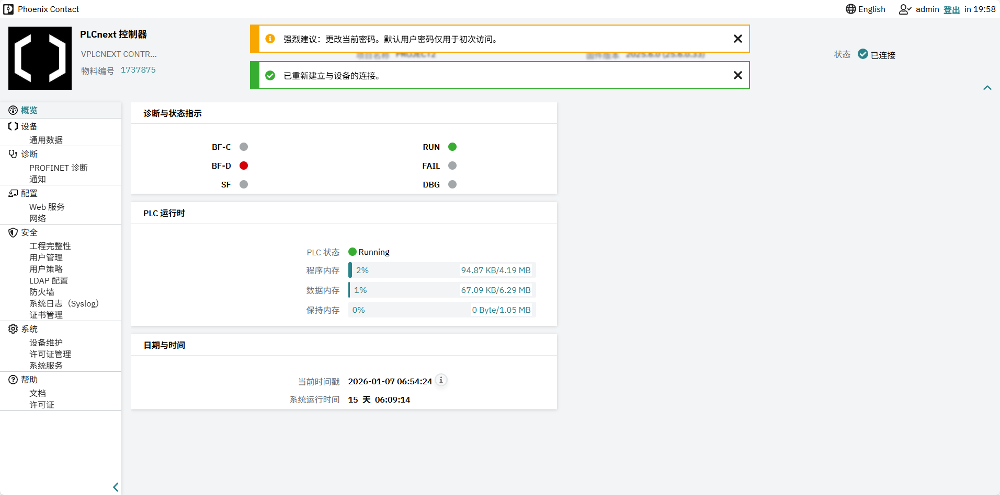

# plcnext_wbm2_ZH_language
A chinese language patch for plcnext device wbm2

# How to use

this will replace the EN language, so please take care. If possible, please backup the original folder in case you want to restore to the default language settings.

## step1

Download this repositry, and copy the `wbm` folder to plcnext device

**For the PLCnext hardware device** 

```
scp -r wbm <your PLCnext device username>@<your PLCnext device ip>:/opt/plcnext
<your PLCnext device username>@<your PLCnext device ip>'s password:

ssh <your PLCnext device username>@<your PLCnext device ip>
sudo su
cp -r wbm /var/www/plcnext/
```

**For the Virtual PLCnext device**
```
scp -r wbm <your host username>@<your host ip>:~/
<your host username>@<your host ip>'s password:

ssh <your host username>@<your host ip>

cd :~/

sudo su

podman ps -a
root@plcnext:/home/plcnext# podman ps -a
CONTAINER ID  IMAGE                                         COMMAND     CREATED     STATUS      PORTS       NAMES
05682e82573b  localhost/vplcnextcontrol1000-arm64:2025.6.0              2 days ago  Up 2 days               vplcnext

podman cp wbm 05682e82573b:/var/www/plcnext/

```

